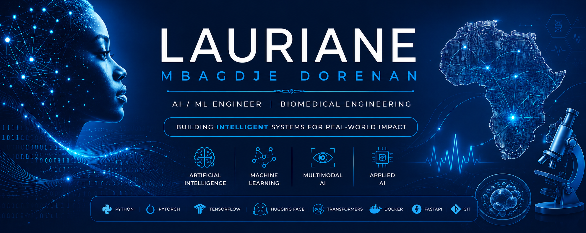

 

 

  

<h2><strong>👩🏾‍💻 About Me</strong></h2>

I am an AI/ML Engineer with a background in Biomedical Engineering and a Master's degree in Artificial Intelligence from the Dakar Institute of Technology.

I develop and evaluate AI solutions for real-world challenges, with interests spanning Machine Learning, Deep Learning, LLMs, NLP, Computer Vision, and multilingual & multimodal AI.

My work combines engineering, applied research, and data to build practical and impactful AI systems.

 

<h2><strong>⚡ Tech Stack & Tools</strong></h2>

<h3><strong>✨ Core Engineering</strong></h3>

<!-- Animated icons inspired by the reference README -->

&nbsp;&nbsp;&nbsp;

&nbsp;&nbsp;&nbsp;

  

<h3><strong>🧠 AI / Machine Learning</strong></h3>

<table align="center">
<tr>
<td align="center" width="105"> <b>Python</b></td>
<td align="center" width="105"> <b>PyTorch</b></td>
<td align="center" width="105"> <b>TensorFlow</b></td>
<td align="center" width="105"> <b>Scikit-learn</b></td>
<td align="center" width="105"> <b>Hugging Face</b></td>
<td align="center" width="105"> <b>LLMs</b></td>
</tr>
<tr>
<td align="center"> <b>Transformers</b></td>
<td align="center"> <b>LoRA / PEFT</b></td>
<td align="center"> <b>Computer Vision</b></td>
<td align="center"> <b>Generative AI</b></td>
<td align="center"> <b>LLM Evaluation</b></td>
<td align="center"> <b>Multimodal AI</b></td>
</tr>
</table>

<h3><strong>🗣️ NLP, Language & Speech AI</strong></h3>

<table align="center">
<tr>
<td align="center" width="115"> <b>NLP</b></td>
<td align="center" width="115"> <b>Whisper ASR</b></td>
<td align="center" width="115"> <b>NLLB-200</b></td>
<td align="center" width="115"> <b>MMS-TTS</b></td>
<td align="center" width="115"> <b>Multilingual AI</b></td>
<td align="center" width="115"> <b>Embeddings</b></td>
</tr>
<tr>
<td align="center"> <b>Prompt Engineering</b></td>
<td align="center"> <b>System Prompts</b></td>
<td align="center"> <b>Semantic Search</b></td>
<td align="center"> <b>Vector Search</b></td>
<td align="center"> <b>Translation</b></td>
<td align="center"> <b>Speech-to-Text</b></td>
</tr>
</table>

<h3><strong>📊 Data & Analytics</strong></h3>

<table align="center">
<tr>
<td align="center" width="110"> <b>Pandas</b></td>
<td align="center" width="110"> <b>NumPy</b></td>
<td align="center" width="110"> <b>PostgreSQL</b></td>
<td align="center" width="110"> <b>pgvector</b></td>
<td align="center" width="110"> <b>Power BI</b></td>
<td align="center" width="110"> <b>Jupyter</b></td>
</tr>
<tr>
<td align="center"> <b>R</b></td>
<td align="center"> <b>Scala</b></td>
<td align="center"> <b>SQL</b></td>
<td align="center"> <b>EDA</b></td>
<td align="center"> <b>Data Analysis</b></td>
<td align="center"> <b>Statistics</b></td>
</tr>
</table>

<h3><strong>⚙️ APIs, Engineering & Deployment</strong></h3>

<table align="center">
<tr>
<td align="center" width="120"> <b>FastAPI</b></td>
<td align="center" width="120"> <b>Docker</b></td>
<td align="center" width="120"> <b>Render</b></td>
<td align="center" width="120"> <b>Vercel</b></td>
<td align="center" width="120"> <b>Supabase</b></td>
<td align="center" width="120"> <b>GitHub Actions</b></td>
</tr>
<tr>
<td align="center"> <b>Git</b></td>
<td align="center"> <b>GitHub</b></td>
<td align="center"> <b>Streamlit</b></td>
<td align="center"> <b>VS Code</b></td>
<td align="center"> <b>Linux</b></td>
<td align="center"> <b>Version Control</b></td>
</tr>
</table>

<h3><strong>🧩 Product & Collaboration</strong></h3>

<table align="center">
<tr>
<td align="center" width="130"> <b>Jira</b></td>
<td align="center" width="130"> <b>Trello</b></td>
<td align="center" width="130"> <b>Notion</b></td>
<td align="center" width="130"> <b>Slack</b></td>
</tr>
</table>

 

<h2><strong>📊 GitHub Activity</strong></h2>

  

<h2><strong>🐍 Contributions</strong></h2>

<h2><strong>🤝 Let's Connect</strong></h2>

AI/ML Engineering · Applied AI Research · Intelligent Systems · Real-World Impact

Open to AI/ML engineering opportunities, research collaborations, and ambitious AI projects.

 

